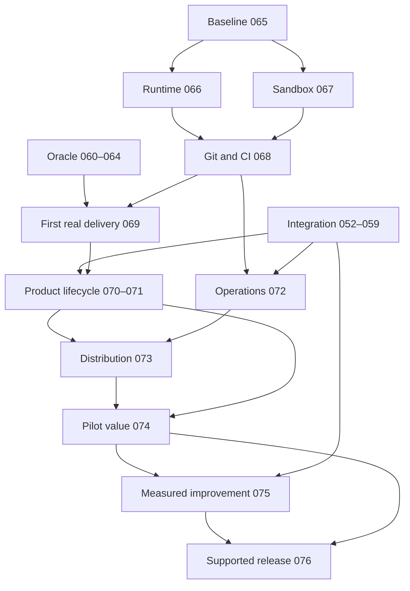

# ExHarness: delivery product roadmap

Status: SCHEDULED RESEARCH; future capabilities are not delivered.
Evidence checked: 2026-09-22. Source baseline: ff85b6c710fc78663ce6e5657f30c5481c61ac62.
Owner of scheduling: docs/blackboard/work-graph.json. This file owns the cross-topic product direction; the existing Integration and Oracle roadmaps retain their narrower contracts.

## Product outcome

A developer connects an allowed repository and model/runtime credentials, supplies a bounded delivery objective and optional requirement/design artifacts, and receives a reviewable change, independently verified deployment evidence, and an explanation of remaining blockers. The system can pause for a product decision, resume after process failure, and incorporate requirement changes without restarting unrelated work. A person other than the author can install, operate, stop, upgrade and recover it.

Initial delivery profile: a small internal request-management web application, with create/list/update requests, validation, persistent storage and a usable browser interface. Go/PostgreSQL + React is a candidate profile, not a mandated platform rewrite. BB-065 chooses the exact fixture and acceptance scenarios before experiments. The first slice is one bounded improvement in an existing repository; greenfield and partial-input projects follow. Do not build a universal organization before measuring the first useful slice.

Value hypothesis: ExHarness reduces human review/coordination effort and failure recovery cost at comparable accepted quality versus the same agent used directly. More roles, more artifacts, more tokens or more completed internal Blackboard tasks do not demonstrate this hypothesis.

## What exists and what remains

Source/Living evidence confirms Core durable effects and recovery primitives, concrete Backend/QA Oracle resolution, organizational A.1 claim authority, and bounded Integration B runtime dispatch/recover/publication. Main exposes runtimeAdapter.dispatch/recover with a pinned attempt binding; that is a usable integration seam, not proof that a real coding-agent service has delivered a product.
BB-052–058 have readiness judgments, but are not marked delivered. BB-059 and BB-060–064 are research. Oracle implementation still resides in agentic-system. This roadmap does not relabel these as production features.

## Technology evidence and reuse decisions

These are research recommendations, not adoption verdicts or a global ranking. Stars were checked through GitHub repository metadata on the evidence date; they are an eligibility filter, not correctness evidence. Before READY, pin the selected dependency release/commit, inspect the relevant source and tests, and reproduce the seam experiment.

| Candidate | Stars | Existing capability / lesson | Remaining ExHarness question | Work |
|---|---:|---|---|---|
| [OpenHands SDK](https://github.com/OpenHands/software-agent-sdk) | 1,155 | MIT coding-agent SDK with agent/server/workspace separation and Python, TypeScript and REST interfaces. First adapter candidate. | Prove dispatch/recover, exact workspace identity, cancellation and telemetry under our attempt binding; SDK success cannot accept product work. | 066–069 |
| [mini-SWE-agent](https://github.com/SWE-agent/mini-swe-agent) | 7,879 | MIT minimal issue-solving loop. Use as direct-agent baseline and study the smallest sufficient tool loop. | Benchmark claims do not establish product delivery, permissions, independent QA or our repository performance. | 065, 066, 074 |
| [LangGraph](https://github.com/langchain-ai/langgraph) | 42,137 | MIT checkpoint/stateful workflow machinery; useful reference for domain-local interruption and persistence. | Do we need graph complexity? Checkpoints do not grant organization authority; in-memory persistence does not survive restart. | 066, 070 |
| [Temporal](https://github.com/temporalio/temporal) | 23,234 | MIT durable service reference; compare operation/recovery model and deployment footprint. | Test same-attempt resume and external-effect ambiguity; decide operational cost versus existing Core and Restate. | 066, 072 |
| [Restate](https://github.com/restatedev/restate) | 4,454 | Durable steps, persisted results, signals and timers fit an existing domain-strategy direction. | Server is BSL 1.1 source-available, not currently unrestricted OSS. Check intended deployment against license; durable journaling does not eliminate the external write/ack ambiguity. | 066, 072 |
| [Playwright](https://github.com/microsoft/playwright) | 96,503 | Apache-2.0 browser automation and trace artifacts give independently observable UI evidence. | Bind observations to exact deployed release; test isolation and independent acceptance design remain ours. | 069–071 |
| [Langfuse](https://github.com/langfuse/langfuse) | 34,935 | Tracing, datasets and evaluations can supply experiment and cost inspection rather than a new custom dashboard. | MIT core has separately licensed enterprise directories. Verify required self-hosted features; traces/scores cannot replace canonical authority or Jev. | 072, 074, 075 |

Additional primary sources:
- [OpenHands SDK sandbox example](https://github.com/OpenHands/software-agent-sdk/blob/main/examples/02_remote_agent_server/04_convo_with_api_sandboxed_server.py): concrete remote runtime integration to inspect.
- [LangGraph persistence](https://docs.langchain.com/oss/python/langgraph/persistence): persistent checkpointers, scope and retention limitations.
- [Restate durable steps](https://docs.restate.dev/develop/ts/durable-steps) and [license](https://github.com/restatedev/restate/blob/main/LICENSE): separate runtime semantics from licensing/adoption.
- [MCP security practices](https://modelcontextprotocol.io/specification/2025-11-25/basic/security_best_practices): token audience, confused deputy, SSRF and session risks. MCP is a transport/capability adapter, not a solution for semantic currentness or product authority.
- [Playwright trace viewer](https://playwright.dev/docs/trace-viewer): inspect action, network and browser evidence.
- [Langfuse evaluations](https://langfuse.com/docs/evaluation/overview) and [license](https://github.com/langfuse/langfuse/blob/main/LICENSE): experiment tooling and edition boundaries.
- [METR productivity study](https://metr.org/Early_2025_AI_Experienced_OS_Devs_Study-paper.pdf) and [2026 design update](https://metr.org/blog/2026-02-24-uplift-update/): task-level productivity needs empirical measurement; older results are not a prediction of current ExHarness performance.

No surveyed source demonstrates the complete ExHarness authority/currentness/delivery contract. That is a scope observation from this survey, not a claim that no product has solved similar problems. Prefer adapters or borrowed patterns; require a measured reason before building competing agent loops, workflow engines, tracing platforms or generic retrieval frameworks.

## Phase roadmap and evidence gates

| Phase / topic | Work | Useful result | Exit evidence |
|---|---|---|---|
| Existing Integration | 052–059 | Cross-domain authority, activation, exact QA/closure, recovery, observation and HOW evolution | Existing objective-specific delivery gates; do not duplicate or weaken |
| Existing Oracle reconciliation | 060–064 | Infrastructure-owned context IO with preserved provenance | Existing package/port/connectivity/durability and drift acceptance |
| Runnable delivery foundation | 065–069 | First real agent changes a real repo and produces independently verified review/deployment evidence | Fixed baseline; adapter and sandbox contract; real Git/CI path; repeatable first slice |
| Product lifecycle | 070–071 | Goal/partial artifacts → owned domain work → running web product; requirement changes repaired locally | Three seed completeness levels and kill/resume/change probes |
| Operable distribution | 072–073 | Another developer installs and operates a bounded single-tenant product | Recovery/telemetry/cost controls; clean-install and upgrade/rollback exercises |
| Pilot and value release | 074–076 | Demonstrated useful delivery, with a reproducible release | Matched baseline comparison, held-out HOW evaluation, independent release reproduction |

Diagram shows phase relationships. Canonical direct task edges are in work-graph.json. Some existing Integration tasks are research-ready but worker-blocked; research may run ahead across all planned tasks. The graph is not a runtime next-role scheduler.

## Research lane contract

Every new task already has an OBJECTIVE, a DRAFT plan, context routing and a task-specific research brief. Start a fresh research session with an explicit ID. Recommended first: BB-065, then BB-066/067; Oracle 060–064 remains independently researchable.

Each brief must converge through:
1. Read the exact current source seam and dependency objectives/plans; distinguish delivered truth from design assumptions.
2. Compare at least two relevant approaches including reuse and the smallest existing-Core solution. Research must record what works, limitations, licensing, integration cost and reasons to reject alternatives.
3. Pin primary sources and the selected source/release. Public repository examples must meet the 1,000-star rule when checked.
4. Design a discriminating experiment: real input, expected observable outcome, failure injection, budget and decision threshold. A mock passing is only a contract check.
5. Produce a concrete implementation plan with exact source/write scope, invariant coverage, acceptance evidence and executable verification commands.
6. Resolve researchGaps in place, rebind source/objective identities, submit to Jev. Only SATISFIED makes READY. Do not run paid pilots or mark simulated evidence as a live result merely to close research.

New DRAFT verification commands are proposed future worker probes, not files claimed to exist. Research must refine them before readiness. The initial broad package-level draft scope is not implementation authorization and must be narrowed before READY.

Source data and artifact content cannot grant authority. Oracle owns IO/adaptation; domain controllers own strategy selection for released work; independent QA/Jev own their respective judgments. Product decisions remain explicit human-owned inputs. Observe remains read-only; strategy evolution has its own evaluation/promotion boundary.

## Pilot measurement protocol

BB-065 fixes task selection, acceptance and budgets before choosing a winning integration. BB-074 proposes at least 20 matched task pairs across two repository/use-case contexts, including a held-out set. This is a proposed minimum pilot size, not a claim of statistical power. Record order effects and task familiarity; use matched variants where replaying the same task leaks a solution.

Compare direct agent and ExHarness with equivalent model/version, tools, starting source and per-task resource ceilings. Report all attempted tasks, failures, abandoned tasks and retries. Compute accepted deliveries / attempted tasks; human active minutes including review, repair and coordination; lead time; total tokens/API/infra expense per accepted delivery; escaped defects during a predeclared observation window; and recovery success. Report paired distributions/uncertainty, not only an average.

Proposed value gate to ratify before the pilot: at least 20% lower median human active time with no drop in accepted quality and no more than 10% increase in total cost per accepted task. These are product hypotheses, not source-backed constants. BB-065 must justify or revise them before measurement; BB-074 cannot loosen them after seeing results. A failed value gate yields a scoped product change or no-go, never fabricated benefit.

BB-069's first delivery gate uses at least three independently reset live runs with one recovery injection and one deliberate defect rejected by QA; it is feasibility evidence only. No claim of production reliability follows from three runs.

## Supported v1 completeness

The release supports one explicit delivery profile and one primary SCM/runtime stack. The default research candidate is GitHub + OpenHands SDK, with a single-tenant local/container deployment; GitLab, Kubernetes-scale tenancy and additional agents remain expansion choices unless pilot needs justify them. At least one alternative agent baseline must remain measurable. No all-provider matrix is required.

Completion requires installation by a fresh operator, one representative real product delivered from its declared inputs, scope-correct permissions, bounded costs/cancellation, durable recovery, independent acceptance, exact release/source evidence, upgrade/rollback/runbooks, a passed predeclared value gate, and stated support boundaries. Source merged in ExHarness is necessary for its feature delivery; the pilot additionally needs actual runtime/product evidence. A green CI, an accepted plan, or a successful agent exit alone cannot close this roadmap.

