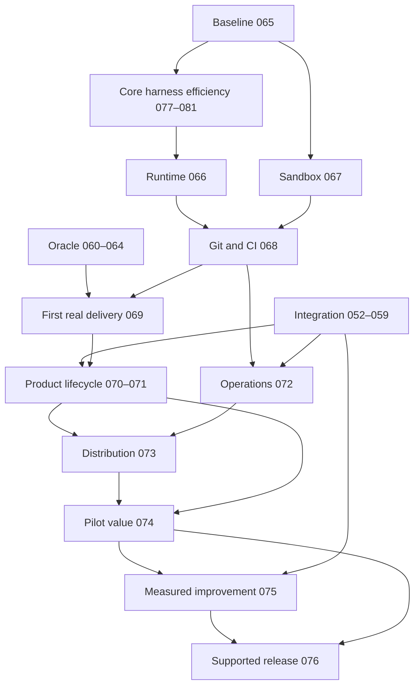

# ExHarness: delivery product roadmap

Status: SCHEDULED RESEARCH; future capabilities are not delivered.
Evidence checked: 2026-09-27. Source baseline for existing product research: aa91ba16548f31772d441f51975917397cbf73d7.
Benchmark-program contract: `docs/blackboard/process/harness-benchmark-program-research.md`.
Owner of scheduling: docs/blackboard/work-graph.json. This file owns the cross-topic product direction; the existing Integration and Oracle roadmaps retain their narrower contracts.

## Product outcome

A developer connects an allowed repository and model/runtime credentials, supplies a bounded delivery objective and optional requirement/design artifacts, and receives a reviewable change, independently verified deployment evidence, and an explanation of remaining blockers. The system can pause for a product decision, resume after process failure, and incorporate requirement changes without restarting unrelated work. A person other than the author can install, operate, stop, upgrade and recover it.

Initial delivery profile: a small internal request-management web application, with create/list/update requests, validation, persistent storage and a usable browser interface. Go/PostgreSQL + React is a candidate profile, not a mandated platform rewrite. BB-065 chooses the exact fixture and acceptance scenarios before experiments. The first slice is one bounded improvement in an existing repository; greenfield and partial-input projects follow. Do not build a universal organization before measuring the first useful slice.

Value hypothesis: ExHarness improves software-delivery economics and reliability at comparable independently accepted quality. The benchmark must isolate harness effects from model/task/environment effects and separately measure lifecycle capabilities that a coding pass-rate benchmark does not cover. More roles, more artifacts, more tokens, a single successful demo or more completed internal Blackboard tasks do not demonstrate this hypothesis.

## What exists and what remains

Source/Living evidence confirms Core durable effects and recovery primitives, concrete Backend/QA Oracle resolution, organizational A.1 claim authority, and bounded Integration B runtime dispatch/recover/publication. Main exposes runtimeAdapter.dispatch/recover with a pinned attempt binding; that is a usable integration seam, not proof that a real coding-agent service has delivered a product.
BB-052–058 have readiness judgments, but are not marked delivered. BB-059 and BB-060–064 are research. Oracle implementation still resides in agentic-system. This roadmap does not relabel these as production features.

## Technology evidence and reuse decisions

These are research recommendations, not adoption verdicts or a global ranking. Stars were checked through GitHub repository metadata on the evidence date; they are an eligibility filter, not correctness evidence. Before READY, pin the selected dependency release/commit, inspect the relevant source and tests, and reproduce the seam experiment.

| Candidate | Stars | Existing capability / lesson | Remaining ExHarness question | Work |
|---|---:|---|---|---|
| [OpenHands SDK](https://github.com/OpenHands/software-agent-sdk) | 1,155 | MIT coding-agent SDK with agent/server/workspace separation and Python, TypeScript and REST interfaces. First adapter candidate. | Prove dispatch/recover, exact workspace identity, cancellation and telemetry under our attempt binding; SDK success cannot accept product work. | 066–069 |
| [mini-SWE-agent](https://github.com/SWE-agent/mini-swe-agent) | 7,879 | MIT minimal issue-solving loop. Use as direct-agent baseline and study the smallest sufficient tool loop. | Benchmark claims do not establish product delivery, permissions, independent QA or our repository performance. | 065, 066, 074 |
| [Harbor](https://github.com/harbor-framework/harbor) | 5,625 | Apache-2.0 neutral agent-evaluation framework with isolated environments, arbitrary agent adapters, trial artifacts/trajectories, verifier outputs and usage/cost reporting. Preferred benchmark-substrate candidate. | Prove its adapter/evidence contracts preserve ExHarness native harness behavior and lifecycle evidence before adoption. | 065, 074, 077, 081 |
| [Unreal Agent](https://github.com/unreallabsai/unreal-agent) | 1,850 | MIT async-first Go harness. Its coordinator/operation/session/context seams are a concrete reference for detached tool work and cache-stable result delivery. | Published cost/pass-rate results are vendor evidence, not ExHarness acceptance. Reproduce the mechanism against the current synchronous Core while preserving EffectOperation authority. | 077–081 |
| [LangGraph](https://github.com/langchain-ai/langgraph) | 42,137 | MIT checkpoint/stateful workflow machinery; useful reference for domain-local interruption and persistence. | Do we need graph complexity? Checkpoints do not grant organization authority; in-memory persistence does not survive restart. | 066, 070 |
| [Temporal](https://github.com/temporalio/temporal) | 23,234 | MIT durable service reference; compare operation/recovery model and deployment footprint. | Test same-attempt resume and external-effect ambiguity; decide operational cost versus existing Core and Restate. | 066, 072 |
| [Restate](https://github.com/restatedev/restate) | 4,454 | Durable steps, persisted results, signals and timers fit an existing domain-strategy direction. | Server is BSL 1.1 source-available, not currently unrestricted OSS. Check intended deployment against license; durable journaling does not eliminate the external write/ack ambiguity. | 066, 072 |
| [Playwright](https://github.com/microsoft/playwright) | 96,503 | Apache-2.0 browser automation and trace artifacts give independently observable UI evidence. | Bind observations to exact deployed release; test isolation and independent acceptance design remain ours. | 069–071 |
| [Langfuse](https://github.com/langfuse/langfuse) | 34,935 | Tracing, datasets and evaluations can supply experiment and cost inspection rather than a new custom dashboard. | MIT core has separately licensed enterprise directories. Verify required self-hosted features; traces/scores cannot replace canonical authority or Jev. | 072, 074, 075 |

Additional primary sources:
- [OpenHands SDK sandbox example](https://github.com/OpenHands/software-agent-sdk/blob/main/examples/02_remote_agent_server/04_convo_with_api_sandboxed_server.py): concrete remote runtime integration to inspect.
- [LangGraph persistence](https://docs.langchain.com/oss/python/langgraph/persistence): persistent checkpointers, scope and retention limitations.
- [Restate durable steps](https://docs.restate.dev/develop/ts/durable-steps) and [license](https://github.com/restatedev/restate/blob/main/LICENSE): separate runtime semantics from licensing/adoption.
- [MCP security practices](https://modelcontextprotocol.io/specification/2025-11-25/basic/security_best_practices): token audience, confused deputy, SSRF and session risks. MCP is a transport/capability adapter, not a solution for semantic currentness or product authority.
- [Playwright trace viewer](https://playwright.dev/docs/trace-viewer): inspect action, network and browser evidence.
- [Langfuse evaluations](https://langfuse.com/docs/evaluation/overview) and [license](https://github.com/langfuse/langfuse/blob/main/LICENSE): experiment tooling and edition boundaries.
- [METR productivity study](https://metr.org/Early_2025_AI_Experienced_OS_Devs_Study-paper.pdf) and [2026 design update](https://metr.org/blog/2026-02-24-uplift-update/): task-level productivity needs empirical measurement; older results are not a prediction of current ExHarness performance.
- [Unreal Agent async-first design](https://unreallabs.ai/blog/unreal-agent/): vendor description and benchmark evidence for detached operations, fewer model turns and prompt-cache stability; not independent ExHarness proof.
- [HarnessTax / AgentBRANE](https://harnesstax.github.io/): independent harness × model evidence motivating harness cost as a controlled experimental variable rather than a hidden implementation detail.
- [Harness-Bench](https://arxiv.org/abs/2605.27922): shared environments, budgets and evaluation protocols across harness/model configurations; captures artifacts, traces, usage and validator output.
- [Claw-SWE-Bench](https://arxiv.org/abs/2606.12344): fixed prompt/runtime/workspace/patch/evaluator contract for harness comparison; evidence that harness choice can be a first-class performance variable.
- [The Scaffold Effect in Coding Agents](https://arxiv.org/abs/2607.22585): fixed-model evidence that harness choice can change token efficiency and failure fingerprints far more than a pass-rate-only view reveals.

No surveyed source demonstrates the complete ExHarness authority/currentness/delivery contract. That is a scope observation from this survey, not a claim that no product has solved similar problems. Prefer adapters or borrowed patterns; require a measured reason before building competing agent loops, workflow engines, tracing platforms or generic retrieval frameworks.

## Phase roadmap and evidence gates

| Phase / topic | Work | Useful result | Exit evidence |
|---|---|---|---|
| Existing Integration | 052–059 | Cross-domain authority, activation, exact QA/closure, recovery, observation and HOW evolution | Existing objective-specific delivery gates; do not duplicate or weaken |
| Existing Oracle reconciliation | 060–064 | Infrastructure-owned context IO with preserved provenance | Existing package/port/connectivity/durability and drift acceptance |
| Core harness efficiency | 077–081 | Research harness-isolation first; then, only if evidence supports it, implement and evaluate async scheduling/context/recovery | Neutral fixed-factor protocol; component ablation; repeated/fault evidence; quality-cost/recovery Pareto gate |
| Runnable delivery foundation | 065–069 | Calibrate the neutral benchmark substrate, then deliver the first real independently verified repository change | Trusted task/evaluator/accounting substrate; adapter and sandbox contract; real Git/CI path; repeatable first slice |
| Product lifecycle | 070–071 | Goal/partial artifacts → owned domain work → running web product; requirement changes repaired locally | Three seed completeness levels and kill/resume/change probes |
| Operable distribution | 072–073 | Another developer installs and operates a bounded single-tenant product | Recovery/telemetry/cost controls; clean-install and upgrade/rollback exercises |
| Pilot and value release | 074–076 | Demonstrated delivery-harness value, measured improvement and reproducible release | Fixed-factor harness comparison + lifecycle benchmark profile + held-out HOW evaluation + independent release reproduction |

Diagram shows phase relationships. Canonical direct task edges are in work-graph.json. Some existing Integration tasks are research-ready but worker-blocked; research may run ahead across all planned tasks. The graph is not a runtime next-role scheduler.

## Research lane contract

Every new task already has an OBJECTIVE, a DRAFT plan, context routing and a task-specific research brief. Start a fresh research session with an explicit ID. Recommended first: BB-065, then BB-066/067; Oracle 060–064 remains independently researchable.

BB-077 and BB-081 have been returned to Research/SA because the previous narrow sync-vs-async benchmark premise is no longer sufficient. BB-077 now researches a neutral fixed-factor harness-isolation protocol; BB-081 researches held-out component ablation and fault robustness. BB-078–080 remain implementation candidates but are worker-blocked by the reopened research dependency. BB-066 still depends on BB-081 so the real coding-agent runtime cannot silently freeze an unmeasured Core profile.

Each brief must converge through:
1. Read the exact current source seam and dependency objectives/plans; distinguish delivered truth from design assumptions.
2. Compare at least two relevant approaches including reuse and the smallest existing-Core solution. Research must record what works, limitations, licensing, integration cost and reasons to reject alternatives.
3. Pin primary sources and the selected source/release. Public repository examples must meet the 1,000-star rule when checked.
4. Design a discriminating experiment: real input, expected observable outcome, failure injection, budget and decision threshold. A mock passing is only a contract check.
5. Produce a concrete implementation plan with exact source/write scope, invariant coverage, acceptance evidence and executable verification commands.
6. Resolve researchGaps in place, rebind source/objective identities, submit to Jev. Only SATISFIED makes READY. Do not run paid pilots or mark simulated evidence as a live result merely to close research.

New DRAFT verification commands are proposed future worker probes, not files claimed to exist. Research must refine them before readiness. The initial broad package-level draft scope is not implementation authorization and must be narrowed before READY.

Source data and artifact content cannot grant authority. Oracle owns IO/adaptation; domain controllers own strategy selection for released work; independent QA/Jev own their respective judgments. Product decisions remain explicit human-owned inputs. Observe remains read-only; strategy evolution has its own evaluation/promotion boundary.

## Benchmark measurement program

The canonical cross-topic contract is `docs/blackboard/process/harness-benchmark-program-research.md`.

BB-065 is now substrate calibration, not a product-value experiment. It must establish task/environment validity, independent verifier behavior, fresh resets, artifact extraction, complete usage/accounting and a failure model in which provider/termination state remains separate from quality.

BB-077 then isolates the harness variable under a fixed model snapshot, prompt/task input, initial workspace, resource ceiling, artifact extraction and evaluator. Research should evaluate Harbor as the neutral substrate and must include a minimal/direct control plus the current ExHarness Core. Report quality together with cost/tokens, latency, no-progress behavior, repeat consistency and failure fingerprints.

BB-081 defines the held-out ablation and robustness protocol for BB-078/079/080. It must attribute detached scheduling, cache-stable context and steering/recovery separately and use repeated runs plus fault injection. Promotion is based on preregistered quality non-inferiority and acceptable cost/latency/recovery trade-offs, never on async architecture preference.

BB-074 measures end-to-end delivery value. It combines an external/public harness workload for external validity with ExHarness-specific lifecycle scenarios such as verifier repair, stale context rejection, crash/resume, handoff, provider ambiguity, CI failure and currentness/claim fencing. Results are a multidimensional profile: accepted quality, economics, lead time, human active effort, consistency, fault robustness, recovery and failure fingerprints. Do not collapse these into one opaque score.

BB-075 must choose a HOW candidate from observed benchmark failure/ablation evidence and evaluate it on held-out work under the same frozen contract. BB-076 must reproduce supported product behavior and the benchmark profile on the exact release.

A failed or inconclusive preregistered gate yields a scoped follow-up or no-go. Thresholds may be researched and ratified before runs, but cannot be loosened after observing results. BB-069's small live-run gate remains feasibility evidence only and must not be reported as production reliability or product-value proof.

## Supported v1 completeness

The release supports one explicit delivery profile and one primary SCM/runtime stack. The default research candidate is GitHub + OpenHands SDK, with a single-tenant local/container deployment; GitLab, Kubernetes-scale tenancy and additional agents remain expansion choices unless pilot needs justify them. At least one alternative agent baseline must remain measurable. No all-provider matrix is required.

Completion requires installation by a fresh operator, one representative real product delivered from its declared inputs, scope-correct permissions, bounded costs/cancellation, durable recovery, independent acceptance, exact release/source evidence, upgrade/rollback/runbooks, a passed predeclared value gate, and stated support boundaries. Source merged in ExHarness is necessary for its feature delivery; the pilot additionally needs actual runtime/product evidence. A green CI, an accepted plan, or a successful agent exit alone cannot close this roadmap.

