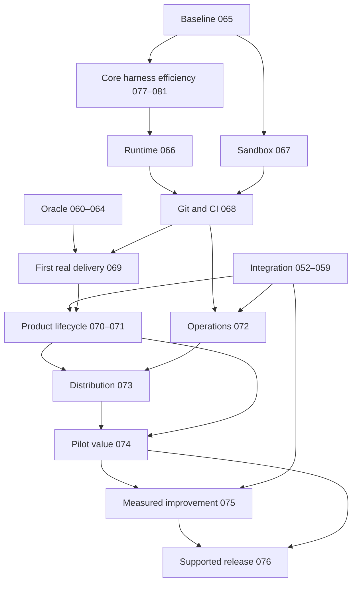

# ExHarness: delivery product roadmap

Status: CROSS-TOPIC DIRECTION; task scheduling and delivery status are owned by the canonical graph.
Current-state audit checked: 2026-10-01 at `4291a4a7900ea3c943a2533581c6abc210b1145f`. Historical technology survey below remains dated 2026-09-27; it is not a fresh adoption verdict.
Benchmark-program contract: `docs/blackboard/process/harness-benchmark-program-research.md`.
Owner of scheduling: docs/blackboard/work-graph.json. This file owns the cross-topic product direction; the existing Integration and Oracle roadmaps retain their narrower contracts.
Operating tracks: [research roadmap](research-roadmap.md) evaluates which research add-ons can be delivered, and which delivered-surface issues are clear enough to repair.

## Product outcome

A developer connects an allowed repository and model/runtime credentials, supplies a bounded delivery objective and optional requirement/design artifacts, and receives a reviewable change, independently verified deployment evidence, and an explanation of remaining blockers. The system can pause for a product decision, resume after process failure, and incorporate requirement changes without restarting unrelated work. A person other than the author can install, operate, stop, upgrade and recover it.

Initial delivery profile: a small internal request-management web application, with create/list/update requests, validation, persistent storage and a usable browser interface. Go/PostgreSQL + React is a candidate profile, not a mandated platform rewrite. BB-065 chooses the exact fixture and acceptance scenarios before experiments. The first slice is one bounded improvement in an existing repository; greenfield and partial-input projects follow. Do not build a universal organization before measuring the first useful slice.

Value hypothesis: ExHarness improves software-delivery economics and reliability at comparable independently accepted quality. The benchmark must isolate harness effects from model/task/environment effects and separately measure lifecycle capabilities that a coding pass-rate benchmark does not cover. More roles, more artifacts, more tokens, a single successful demo or more completed internal Blackboard tasks do not demonstrate this hypothesis.

## What exists and what remains

Current source and terminal receipts confirm Integration C through I, the Oracle foundation/Context Graph/planner/progressive resolution/budget profiles, the neutral benchmark package, durable detached operations, cache-stable async context, grounded observation, real local git/command verification, supervised CLI agents, observation, durable recovery, Backend adapter, declared context, MCP verification, Grok, OpenCode, and local `deliver`. BB-052..058, BB-060..065, BB-077/078/079, BB-084, BB-087..093, BB-096..106, BB-108 and BB-122 are delivered. Live comparative value remains unclaimed.

Remaining Worker-ready work includes Integration J (BB-059), async steering/recovery (BB-080), feedback episode lifecycle (BB-085), and the blocked OpenHands/sandbox/SCM/lifecycle/release and Oracle-profile chains. Remaining research is DRAFT: planner reservation, child/verifier env, grok-cost/gitignore, accounting, resume binding, durable Board injection, operator tool parity, protected acceptance, review bundle, retry-policy hypothesis, unproven preview/browser/API profiles, operator CLI composition of delivered recovery, traces, MCP, and run options, remaining CLI factor parity for deliver limits, eval factors, and smoke options, Application adapter composition of recovery and MCP, and deliver CLI tool override.

The current [research roadmap](research-roadmap.md) is the delivery-feasibility and delivered-surface review. Near-term local work reuses delivered source without waiting on the broad OpenHands/async program. Existing worker dependencies and acceptance gates remain intact; local source/fixture success does not prove BB-069/074 live value.

## Operating tracks

1. **Research-gated add-on features.** Research may send a feature to implementation only after it evaluates that the feature can be delivered: current seam, executed discriminating evidence, bounded write scope, named dependencies, independent acceptance, and explicit non-goals. BB-121, BB-127, BB-128, BB-129 and BB-134..143 currently pass that evaluation as bounded local add-ons. BB-131/132/133 fail it until a prototype runs. BB-126 fails it as an unclear optimization.

2. **Delivered-surface review.** Repair only issues that are already clear on current main. BB-107, BB-120, BB-123, BB-124, BB-125 and BB-130 are probe-backed defects. Do not open planner/Core/Jev speed work, live-value claims, or retry-policy defaults from an unmeasured hypothesis.

## Current value-discovery priority

Priority follows the [research roadmap](research-roadmap.md) queue: repair delivered defects, ship add-ons whose delivery evaluation already passed, then keep unproven capabilities in research. The [2026-09-30 capability discovery](delivery-capability-discovery.md) still owns BB-131 repository preview, BB-132 independent browser journeys and BB-133 API/data compatibility as DRAFT research. Their useful milestone remains a runnable existing-repository feature, observed user behavior, retained prior behavior and a replayable reviewer handoff. Six eligible OSS candidates and primary reports are pinned; adoption and capability prototypes remain open, so those three tasks are not delivery candidates yet.

Goal/document clarification, live feature feasibility, requirement evolution, supported installation and measured human effort remain with BB-070/069/071/073/074. Their existing objectives/plans are preserved. Defer optimization with an unclear baseline or target, including BB-126 policy priority, until independent quality/value controls are ratified. Existing correctness repairs retain their bounded gates.

## Technology evidence and reuse decisions

These are research recommendations, not adoption verdicts or a global ranking. Stars were checked through GitHub repository metadata on the evidence date; they are an eligibility filter, not correctness evidence. Before READY, pin the selected dependency release/commit, inspect the relevant source and tests, and reproduce the seam experiment.

| Candidate | Stars | Existing capability / lesson | Remaining ExHarness question | Work |
|---|---:|---|---|---|
| [OpenHands SDK](https://github.com/OpenHands/software-agent-sdk) | 1,155 | MIT coding-agent SDK with agent/server/workspace separation and Python, TypeScript and REST interfaces. First adapter candidate. | Prove dispatch/recover, exact workspace identity, cancellation and telemetry under our attempt binding; SDK success cannot accept product work. | 066–069 |
| [mini-SWE-agent](https://github.com/SWE-agent/mini-swe-agent) | 7,879 | MIT minimal issue-solving loop. Use as direct-agent baseline and study the smallest sufficient tool loop. | Benchmark claims do not establish product delivery, permissions, independent QA or our repository performance. | 065, 066, 074 |
| [Harbor](https://github.com/harbor-framework/harbor) | 5,625 | Apache-2.0 neutral agent-evaluation framework with isolated environments, arbitrary agent adapters, trial artifacts/trajectories, verifier outputs and usage/cost reporting. Preferred benchmark-substrate candidate. | Prove its adapter/evidence contracts preserve ExHarness native harness behavior and lifecycle evidence before adoption. | 065, 074, 077, 081 |
| [Unreal Agent](https://github.com/unreallabsai/unreal-agent) | 1,850 | MIT async-first Go harness. Its coordinator/operation/session/context seams are a concrete reference for detached tool work and cache-stable result delivery. | Published cost/pass-rate results are vendor evidence, not ExHarness acceptance. Reproduce the mechanism against the current synchronous Core while preserving EffectOperation authority. | 077–081 |
| [LangGraph](https://github.com/langchain-ai/langgraph) | 42,137 | MIT checkpoint/stateful workflow machinery; useful reference for domain-local interruption and persistence. | Do we need graph complexity? Checkpoints do not grant organization authority; in-memory persistence does not survive restart. | 066, 070 |
| [Temporal](https://github.com/temporalio/temporal) | 23,234 | MIT durable service reference; compare operation/recovery model and deployment footprint. | Test same-attempt resume and external-effect ambiguity; decide operational cost versus existing Core and Restate. | 066, 072 |
| [Restate](https://github.com/restatedev/restate) | 4,454 | Durable steps, persisted results, signals and timers fit an existing domain-strategy direction. | Server is BSL 1.1 source-available, not currently unrestricted OSS. Check intended deployment against license; durable journaling does not eliminate the external write/ack ambiguity. | 066, 072 |
| [Playwright](https://github.com/microsoft/playwright) | 96,503 | Apache-2.0 browser automation and trace artifacts give independently observable UI evidence. | Bind observations to exact deployed release; test isolation and independent acceptance design remain ours. | 069–071 |
| [Langfuse](https://github.com/langfuse/langfuse) | 34,935 | Tracing, datasets and evaluations can supply experiment and cost inspection rather than a new custom dashboard. | MIT core has separately licensed enterprise directories. Verify required self-hosted features; traces/scores cannot replace canonical authority or Jev. | 072, 074, 075 |

Additional primary sources:
- [OpenHands SDK sandbox example](https://github.com/OpenHands/software-agent-sdk/blob/main/examples/02_remote_agent_server/04_convo_with_api_sandboxed_server.py): concrete remote runtime integration to inspect.
- [LangGraph persistence](https://docs.langchain.com/oss/python/langgraph/persistence): persistent checkpointers, scope and retention limitations.
- [Restate durable steps](https://docs.restate.dev/develop/ts/durable-steps) and [license](https://github.com/restatedev/restate/blob/main/LICENSE): separate runtime semantics from licensing/adoption.
- [MCP security practices](https://modelcontextprotocol.io/specification/2025-11-25/basic/security_best_practices): token audience, confused deputy, SSRF and session risks. MCP is a transport/capability adapter, not a solution for semantic currentness or product authority.
- [Playwright trace viewer](https://playwright.dev/docs/trace-viewer): inspect action, network and browser evidence.
- [Langfuse evaluations](https://langfuse.com/docs/evaluation/overview) and [license](https://github.com/langfuse/langfuse/blob/main/LICENSE): experiment tooling and edition boundaries.
- [METR productivity study](https://metr.org/Early_2025_AI_Experienced_OS_Devs_Study-paper.pdf) and [2026 design update](https://metr.org/blog/2026-02-24-uplift-update/): task-level productivity needs empirical measurement; older results are not a prediction of current ExHarness performance.
- [Unreal Agent async-first design](https://unreallabs.ai/blog/unreal-agent/): vendor description and benchmark evidence for detached operations, fewer model turns and prompt-cache stability; not independent ExHarness proof.
- [HarnessTax / AgentBRANE](https://harnesstax.github.io/): independent harness × model evidence motivating harness cost as a controlled experimental variable rather than a hidden implementation detail.
- [Harness-Bench](https://arxiv.org/abs/2605.27922): shared environments, budgets and evaluation protocols across harness/model configurations; captures artifacts, traces, usage and validator output.
- [Claw-SWE-Bench](https://arxiv.org/abs/2606.12344): fixed prompt/runtime/workspace/patch/evaluator contract for harness comparison; evidence that harness choice can be a first-class performance variable.
- [The Scaffold Effect in Coding Agents](https://arxiv.org/abs/2607.22585): fixed-model evidence that harness choice can change token efficiency and failure fingerprints far more than a pass-rate-only view reveals.

No surveyed source demonstrates the complete ExHarness authority/currentness/delivery contract. That is a scope observation from this survey, not a claim that no product has solved similar problems. Prefer adapters or borrowed patterns; require a measured reason before building competing agent loops, workflow engines, tracing platforms or generic retrieval frameworks.

## Phase roadmap and evidence gates

| Phase / topic | Work | Useful result | Exit evidence |
|---|---|---|---|
| Existing Integration | 052–059 | C–I are delivered; remaining proof is evidence-gated HOW evolution (059) | Existing objective-specific delivery gates; do not duplicate or weaken |
| Existing Oracle reconciliation | 060–064 | Infrastructure-owned context IO with preserved provenance | Existing package/port/connectivity/durability and drift acceptance |
| Core harness efficiency | 077–081 | Research harness-isolation first; then, only if evidence supports it, implement and evaluate async scheduling/context/recovery | Neutral fixed-factor protocol; component ablation; repeated/fault evidence; quality-cost/recovery Pareto gate |
| Runnable delivery foundation | 065–069 | Calibrate the neutral benchmark substrate, then deliver the first real independently verified repository change | Trusted task/evaluator/accounting substrate; adapter and sandbox contract; real Git/CI path; repeatable first slice |
| Product lifecycle | 070–071 | Goal/partial artifacts → owned domain work → running web product; requirement changes repaired locally | Three seed completeness levels and kill/resume/change probes |
| Operable distribution | 072–073 | Another developer installs and operates a bounded single-tenant product | Recovery/telemetry/cost controls; clean-install and upgrade/rollback exercises |
| Pilot and value release | 074–076 | Demonstrated delivery-harness value, measured improvement and reproducible release | Fixed-factor harness comparison + lifecycle benchmark profile + held-out HOW evaluation + independent release reproduction |

```mermaid
flowchart TD
  I["Integration 052–059"] --> L["Product lifecycle 070–071"]
  O["Oracle 060–064"] --> V["First real delivery 069"]
  B["Baseline 065"] --> H["Core harness efficiency 077–081"]
  H --> R["Runtime 066"]
  B --> S["Sandbox 067"]
  R --> G["Git and CI 068"]
  S --> G
  G --> V
  V --> L
  G --> OP["Operations 072"]
  I --> OP
  L --> D["Distribution 073"]
  OP --> D
  D --> P["Pilot value 074"]
  L --> P
  P --> E["Measured improvement 075"]
  I --> E
  E --> GA["Supported release 076"]
  P --> GA
```

Diagram shows phase relationships. Canonical direct task edges are in work-graph.json. Some existing Integration tasks are research-ready but worker-blocked; research may run ahead across all planned tasks. The graph is not a runtime next-role scheduler.

## Research lane contract

Each newly registered discovery task BB-124..140 has an OBJECTIVE, a DRAFT plan, context routing and a discovery brief. The operator CLI composition wave BB-134..137 is registered in [operator-cli-composition.md](operator-cli-composition.md). Remaining command factor parity BB-138..140 is registered in [operator-cli-factor-parity.md](operator-cli-factor-parity.md). Existing researched tasks retain their READY plans. Start Research with an explicit ID; BB-065 and Oracle foundation 060..064 are already DONE.

The accepted research for BB-077 and BB-081 replaced the earlier narrow sync-vs-async premise with a neutral comparison protocol; both are now WORKER plans in the graph. Their plans own a neutral fixed-factor protocol and held-out component ablation/fault robustness. BB-077 and BB-078 are delivered; BB-079 is WORKER_SCHEDULABLE; BB-080 waits on BB-079. They are not reopened research. BB-066 still depends on BB-081 so the real coding-agent runtime cannot silently freeze an unmeasured Core profile.

Each brief must converge through:
1. Read the exact current source seam and dependency objectives/plans; distinguish delivered truth from design assumptions.
2. Compare at least two relevant approaches including reuse and the smallest existing-Core solution. Research must record what works, limitations, licensing, integration cost and reasons to reject alternatives.
3. Pin primary sources and the selected source/release. Public repository examples must meet the 1,000-star rule when checked.
4. Design a discriminating experiment: real input, expected observable outcome, failure injection, budget and decision threshold. A mock passing is only a contract check.
5. Produce a concrete implementation plan with exact source/write scope, invariant coverage, acceptance evidence and executable verification commands.
6. Resolve researchGaps in place, rebind source/objective identities, submit to Jev. Only SATISFIED makes READY. Do not run paid pilots or mark simulated evidence as a live result merely to close research.

New DRAFT verification commands are proposed future worker probes, not files claimed to exist. Research must refine them before readiness. The initial broad package-level draft scope is not implementation authorization and must be narrowed before READY.

Source data and artifact content cannot grant authority. Oracle owns IO/adaptation; domain controllers own strategy selection for released work; independent QA/Jev own their respective judgments. Product decisions remain explicit human-owned inputs. Observe remains read-only; strategy evolution has its own evaluation/promotion boundary.

## Benchmark measurement program

The canonical cross-topic contract is `docs/blackboard/process/harness-benchmark-program-research.md`.

BB-065 delivered substrate calibration and the neutral kernel; it is not a product-value experiment. Its contract establishes task/environment validity, independent verifier behavior, fresh resets, artifact extraction, complete usage/accounting and a failure model in which provider/termination state remains separate from quality.

BB-077 then isolates the harness variable under a fixed model snapshot, prompt/task input, initial workspace, resource ceiling, artifact extraction and evaluator. Research should evaluate Harbor as the neutral substrate and must include a minimal/direct control plus the current ExHarness Core. Report quality together with cost/tokens, latency, no-progress behavior, repeat consistency and failure fingerprints.

BB-081 defines the held-out ablation and robustness protocol for BB-078/079/080. It must attribute detached scheduling, cache-stable context and steering/recovery separately and use repeated runs plus fault injection. Promotion is based on preregistered quality non-inferiority and acceptable cost/latency/recovery trade-offs, never on async architecture preference.

BB-074 measures end-to-end delivery value. It combines an external/public harness workload for external validity with ExHarness-specific lifecycle scenarios such as verifier repair, stale context rejection, crash/resume, handoff, provider ambiguity, CI failure and currentness/claim fencing. Results are a multidimensional profile: accepted quality, economics, lead time, human active effort, consistency, fault robustness, recovery and failure fingerprints. Do not collapse these into one opaque score.

BB-075 must choose a HOW candidate from observed benchmark failure/ablation evidence and evaluate it on held-out work under the same frozen contract. BB-076 must reproduce supported product behavior and the benchmark profile on the exact release.

A failed or inconclusive preregistered gate yields a scoped follow-up or no-go. Thresholds may be researched and ratified before runs, but cannot be loosened after observing results. BB-069's small live-run gate remains feasibility evidence only and must not be reported as production reliability or product-value proof.

## Supported v1 completeness

The release supports one explicit delivery profile and one primary SCM/runtime stack. The default research candidate is GitHub + OpenHands SDK, with a single-tenant local/container deployment; GitLab, Kubernetes-scale tenancy and additional agents remain expansion choices unless pilot needs justify them. At least one alternative agent baseline must remain measurable. No all-provider matrix is required.

Completion requires installation by a fresh operator, one representative real product delivered from its declared inputs, scope-correct permissions, bounded costs/cancellation, durable recovery, independent acceptance, exact release/source evidence, upgrade/rollback/runbooks, a passed predeclared value gate, and stated support boundaries. Source merged in ExHarness is necessary for its feature delivery; the pilot additionally needs actual runtime/product evidence. A green CI, an accepted plan, or a successful agent exit alone cannot close this roadmap.

## Additive feedback research — BB-083

[BB-083](feedback-architecture-research.md) is a new research task connecting context-grounded feedback episodes, response/resolution, cross-episode patterns and reinforcement to independent improvement evaluation. Existing researched tasks, including BB-058/059/075, retain their accepted scope and readiness unchanged.

The new task consumes BB-059, BB-064 and BB-075 as direct execution dependencies; their transitive Observer/benchmark dependencies are not duplicated. Research may run ahead; no existing task is made dependent on BB-083. The new objective and DRAFT plan must converge through their own research and fresh Jev readiness. This is future additive capability, not delivered behavior or an extension authorized by old judgments.

## Observed / Feedback / Self-Improve split — BB-084..086

BB-083 research is consumed as design input by three one-way layers: [BB-084](observed-feedback-self-improve-research.md) Observed Implementation (grounded observation over BB-058/BB-064), BB-085 Feedback Lifecycle (episode -> response -> fresh outcome -> resolution over BB-084) and BB-086 Self-Improve (cross-episode pattern -> proposal -> GEPA -> independent BB-059 handoff over BB-085/BB-059/BB-065). Research runs ahead on planned contracts; each Worker waits for its direct dependencies to be DONE. BB-083's canonical record is unchanged until BB-082 objective supersession can reconcile it.

## Oracle post-foundation discovery — BB-087..089

[Discovery brief](oracle-post-foundation-discovery.md): BB-087 fixes delivered facade budget accounting and typed provider failure (executed probe evidence), BB-088 productizes the authoritative snapshot-bound Context Graph (first BB-064 continuation), BB-089 adopts the facade for Backend/QA production context behind an opt-in option. Remaining BB-064 continuations stay unregistered until the Context Graph desired state exists.

## Worker gate gap + Oracle continuations — BB-090..095

[Brief](gate-gap-and-oracle-continuations.md): BB-090 closes the Worker gate gap that let BB-064 pass with untested negatives (BB-064 stays DONE). BB-091..095 register the remaining BB-064 continuations in fixed order: planner ablation, progressive resolution, budget profiles, Core profile conformance, held-out profile acceptance.

## Real Backend/QA execution � BB-096

[Research brief](delivery-research/BB-096.md): the executed probe shows delivered Backend ACCEPT with PASS mutation/typecheck/tests on an unchanged real repository whose test fails; BB-096 adds a local git workspace and shell-free command verifier and proves Backend/QA through a real Core CodeAct strategy. Live provider, sandbox and SCM remain BB-066..068.

## Agent-tool integration and measured value — BB-097..099

Briefs: [BB-097](agent-tool-research/BB-097.md) runs Codex, Kiro and agy under ExHarness supervision (outer loop over the BB-096 workspace/verifiers), [BB-098](agent-tool-research/BB-098.md) observes every direct and supervised invocation as redacted digest-chained traces, [BB-099](agent-tool-research/BB-099.md) measures supervised versus direct delivery per tool with a DIRECT_RETRY control on the BB-065 benchmark kernel.

## Agent-tool productization — BB-100..104

[Discovery brief](agent-tool-productization.md): the 2026-09-30 probe against BB-096/BB-097 is historical. BB-100..104 are now DONE, as are Grok (BB-105) and OpenCode (BB-122). Current source composes Backend/QA, Oracle facade, and agent-tools at those seams. Remaining gaps are owned by later research (env, accounting, resume binding, operator parity, protected acceptance, review bundle, durable Board injection). Sandbox (BB-067), OpenHands domain runtime (BB-066), BB-069 first-slice and generic PM/SA runtime stay unregistered here.

## Additive delivery value improvements — BB-124..133

[Research discovery](delivery-value-improvement-research.md) and [capability discovery](delivery-capability-discovery.md) remain DRAFT. The [research roadmap](research-roadmap.md) now splits them by delivery evaluation:

- **Can deliver after READY:** BB-107, BB-120, BB-123, BB-124, BB-125, BB-130 (clear delivered defects); BB-121, BB-127, BB-128, BB-129 (bounded add-ons on existing seams).
- **Stay research:** BB-126 (unclear retry optimization); BB-131, BB-132, BB-133 (named capability gap, unrun prototypes).

Useful local outcome, when those deliverable items ship: a developer uses an available CLI for one bounded repository change, receives a candidate checked by an independently pinned evaluator, and hands another developer a portable exact revision with inspectable evidence. SCM automation, sandboxing, installable support, live comparative value and release remain owned by their existing tasks. Efficiency defaults require matched quality/coverage evidence, not a lower call count alone.
